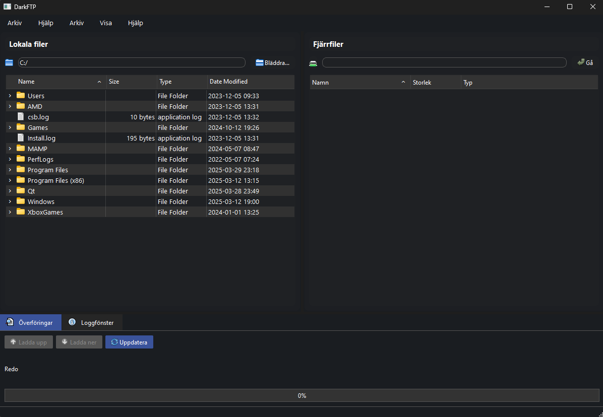

# DarkFTP


En modern, elegant och användarvänlig FTP/SFTP-klient med fokus på design och användbarhet.

## Skärmdump



## Funktioner

- **Dual-pane gränssnitt** - Överför filer enkelt mellan lokal och fjärrserver
- **Drag-and-drop** - Dra filer för att överföra dem mellan lokal dator och fjärrserver
- **Stöd för både FTP och SFTP** - Anslut med standard FTP eller säker SFTP
- **Visuell överföringsindikator** - Se tydligt överföringsframsteg
- **Flera anpassningsbara teman** - Välj mellan Dark, Retro Blue, Steampunk och Hacker theme
- **Sparade anslutningar** - Spara dina anslutningar för snabb åtkomst
- **Detaljerad loggning** - Se exakt vad som händer med dina överföringar

## Installation

### Windows
1. Ladda ner senaste versionen från [Releases](https://github.com/yourusername/DarkFTP/releases)
2. Extrahera alla filer i ZIP-arkivet
3. Kör `DarkFTP.exe`

### macOS
1. Ladda ner senaste versionen från [Releases](https://github.com/yourusername/DarkFTP/releases)
2. Montera .dmg-filen
3. Dra DarkFTP till din Applications-mapp

### Från källkod
För att bygga från källkod behöver du:
1. Qt 6.8.3 eller senare
2. CMake 3.16 eller senare
3. C++17-kompatibel kompilator

```bash
# Klona repo
git clone https://github.com/yourusername/DarkFTP.git
cd DarkFTP

# Konfigurera och bygg
mkdir build && cd build
cmake ..
cmake --build . --config Release

# Distribuera (Windows)
windeployqt DarkFTP.exe

# Distribuera (macOS)
macdeployqt DarkFTP.app
```

## Användning

### Ansluta till en server
1. Klicka på "Anslut..." eller använd `Ctrl+N`
2. Ange serverinformation:
   - Serveradress (t.ex. ftp.example.com)
   - Användarnamn
   - Lösenord
   - Port (standard: 21 för FTP, 22 för SFTP)
   - Välj anslutningstyp (FTP/SFTP)
3. Klicka på "Anslut"

### Överföra filer
- **Drag and drop**: Dra filer mellan lokal och fjärrpanel
- **Knappar**: Välj fil och klicka på "Ladda upp" eller "Ladda ner"
- **Kontextmeny**: Högerklicka på en fil för överföringsalternativ

### Byta tema
1. Gå till "Visa" > "Tema"
2. Välj bland tillgängliga teman

## Teknisk information

DarkFTP är byggd med följande teknologier:
- Qt 6.8.3 - GUI-ramverk
- C++17 - Programmeringsspråk
- CMake - Bygghantering

## Bidrag

Bidrag är välkomna! Se [CONTRIBUTING.md](CONTRIBUTING.md) för mer information.

## Licens

Detta projekt är licensierat under MIT-licensen - se [LICENSE](LICENSE) för detaljer.

## Utvecklare

David Johansson - [GitHub](https://github.com/yourusername) - email@example.com

---

*DarkFTP är ett projekt som skapats som en del av kursprojekt FSU23D, 2025.* 